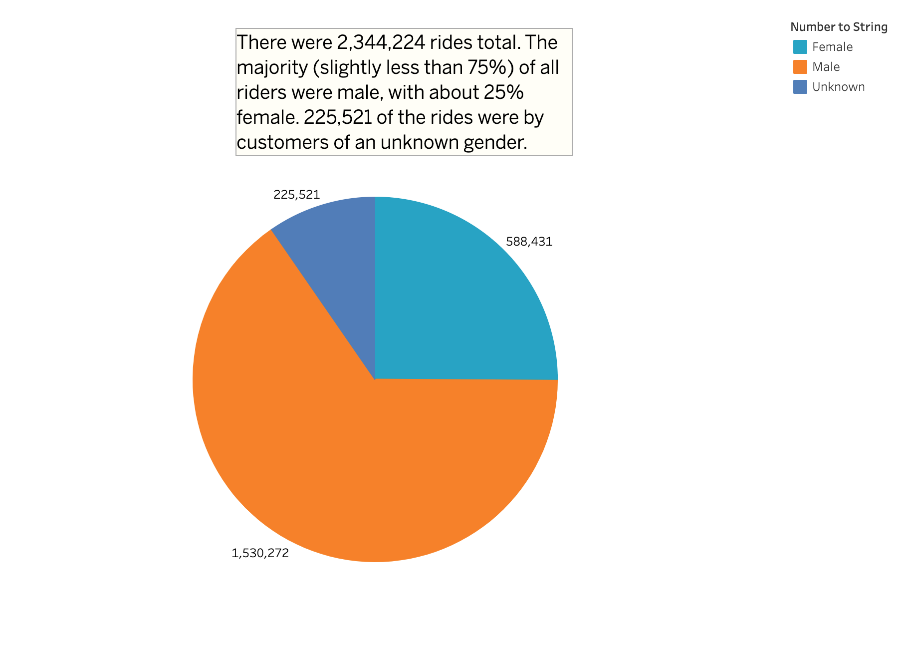
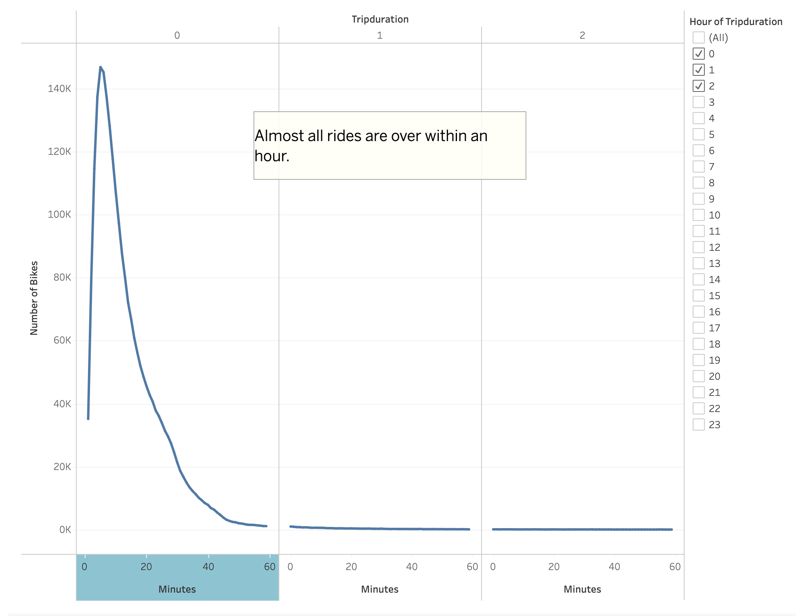
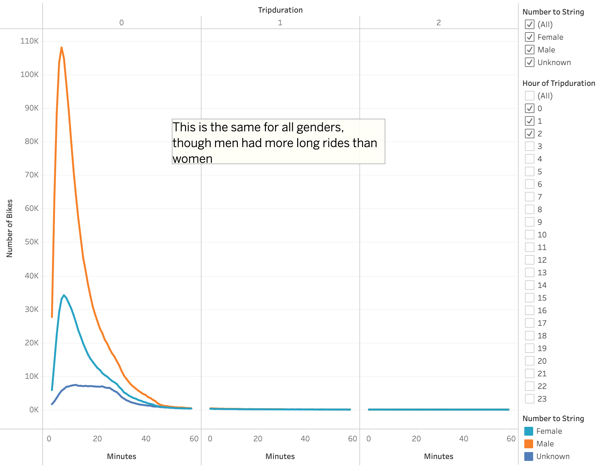
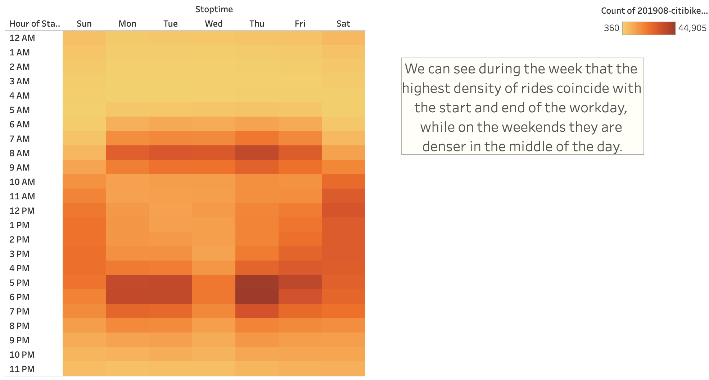
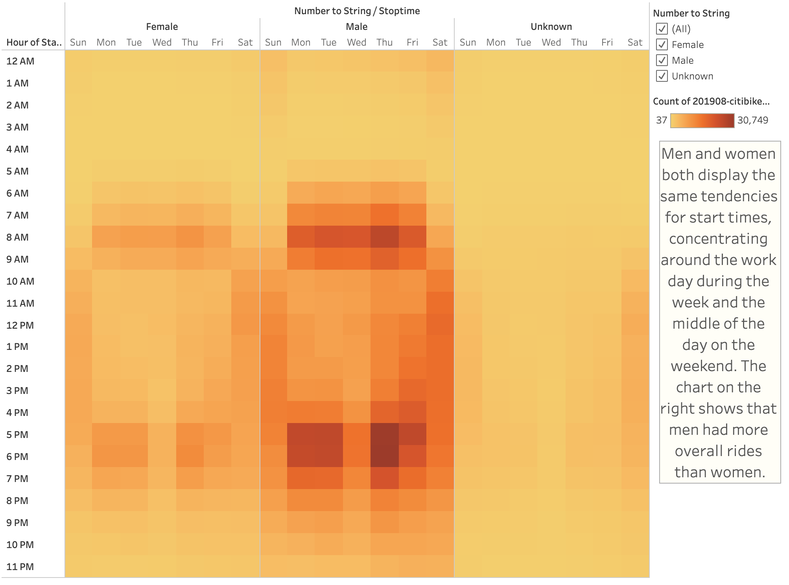
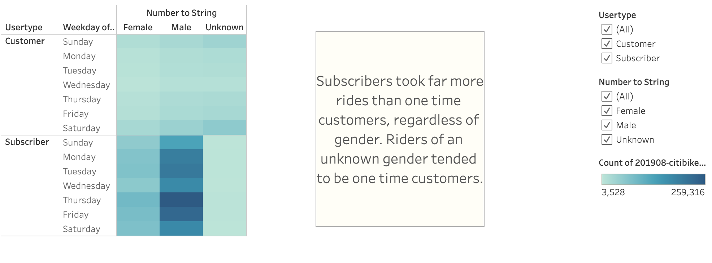
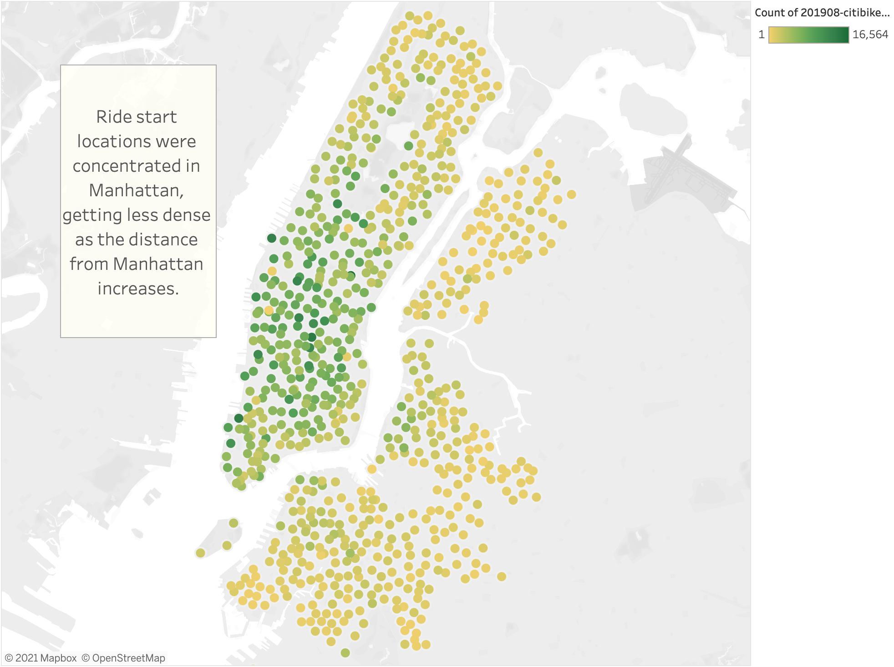

# bikeshare

## Project Overview
By analyzing data from a bike sharing program in New York City, we were able to glean valuable information that will help us with starting our own bike sharing program in our home city. Tableau is a valuable tool in showcasing and visualizing data, and we will use a Tableau Story to share our findings. The data we used was collected from the CitiBike website, and is the trip data for all rides from the month of August of 2019.

The results of our analysis are below, but you can see our story on Tableau Public's servers here. [link to story] (https://public.tableau.com/app/profile/peter.dyke/viz/P_Dyke_CityBike_Challenge_Story/CityBikeStory?publish=yes)

## Resources
Data Source: 2019-citibike-tripdata.csv, 2019-citibike-tripdata-new.csv
Software Used: Tableau Public, Visual Studio Code v1.60.2

## Analysis

### Results
Below are a few of the visualizations created in our analysis with a brief blurb about the data.

* First we can see the breakdown of riders by gender:

* We can see that there were over 2.3 million bike rides taken through the bike share program in NYC during our selected month, of which 1,530,272 (65.3%) were male, 588,431(25.1%) were female, and the remaining 225,521 (9.6%) did not declare their gender.

* Next we see the length of each ride:

* We can see that essentially all rides were over within one hour of checkout, which would suggest that riders were using the bikes primarily for shorter utilitarian trips rather than sightseeing or longer rides.

* Here is that same data broken down further by gender:

* Men overall had more rides, and longer rides than women, but the same trend holds true that almost all rides were over within one hour of the rental.
* Next is a heatmap of when each ride began, by hour and weekday:

* The darker color means more rides, so during the week we can see that rides concentrated around 7-8am, and 5-6pm. This would line up with peoples morning commutes suggesting they use the bike service to get to and from work. On the weekends the rides are more spreadout, but there is a higher density from late morning to mid afternoon.

* Here is the same data broken down by gender:

* Again the same patterns hold true for all genders, with men comprising the majority of the data points, so the Male heatmap is more pronounced.

* Here again is similar data, this time broken down by both gender, and by user type:

* We can see on the bottom map that Subscribers make up the majority of our data set, and that they use rides more often than one time users. They are also more concentrated during the week.

* Lastly we can look at the average starting locations of rides:

* We can see that most rides are concentrated in the city center, in this case Manhattan

## Summary 
After looking at the data and our visualizations, I believe we can glean some important insight into how to target and market our Bikeshare service in our target city. An important piece of information would be to make sure that our city is bike friendly and easily traversed by bike. People need to be able to reach their destination well within an hour, and would need to have bikes available to get to and from work in order to be able to target commuters. Two analyses that I would like to see done would be to see the age breakdown of riders, and to see the distribution of ride start times in certain age brackets.

